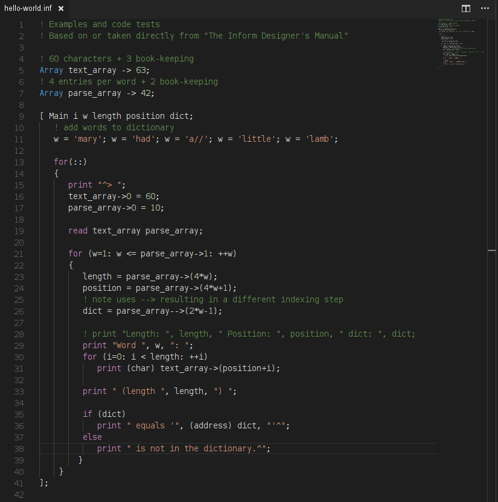

# Inform 6 syntax highlighting

This extension provides basic syntax highlighting for the inform6 interactive fiction language.

Supports highlighting of keywords, directives, comments and numerics.

## Install

To use this extension, copy all files to  `<user home>/.vscode/extensions` and restart vs-code.
